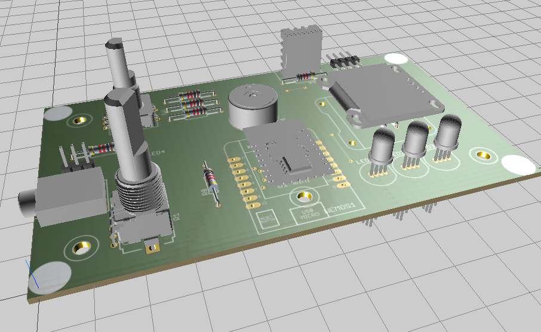

# AALeC - AAlener Lern-Computer (Hardware)

## Beschreibung

AALeC ist der Aalener Lerncomputer. Er basiert auf einem ESP8266, welcher als
Wemos-D1-Mini-Modul eingesetzt wird.

Sensoren:
* DHT11-Umweltsensor für Temperatur und Luftfeuchte
* Dreh- / Drückgeber
* Analoges Potentiometer

Aktoren / Ausgabeelemente:
* Drei Fullcolor-Leuchtdioden PL9823 (WS2812B-kompatibel)
* OLED-Display
* Lautsprecher
* LED einfach

Externe Anschlüsse:
* I2C (4-Pin-Header)
* Analogeingang (3,5mm-Klinke)

Die Programmierung kann in allen Sprachen erfolgen, die für den ESP8266
verfügbar sind. Für Arduino-Programmierung in C / C++ steht diese 
[Bibliothek](https://github.com/informatik-aalen/AALeC) zur
Verfügung, die die Programmierung stark vereinfacht.

## Materialliste mit Vorschlag für die jeweiligen Lieferanten

|Anzahl|Bezeichnung|Lieferant|Bestell-Nr.|Einzelpreis in Euro|Gesamtpreis in Euro|Internet Link|
|---|---|---|---|---:|---:|---|
|1|Gehäuse Kemo G091|aaaa|Kemo G901|4,00|4,00|[Link zum Artikel](http://www.aaaa-electronic.de/products.php?KEMO-G091-Klarsichtdeckelgehaeuse-Transp-case-1-Stueck-p)|
||||||||
|1|Drehimpulsgeber Alps STEC11B|Reichelt|STEC11B13|4,45|4,45|[Link zum Artikel](https://www.reichelt.de/Drehimpulsgeber/STEC11B13/3/index.html?ACTION=3&LA=446&ARTICLE=73916&GROUPID=3714&artnr=STEC11B13&SEARCH=STEC11B13)|
|1|Drehpoti 10K/280°|Reichelt|RK09K113-LIN10K|0,76|0,76|[Link zum Artikel](https://www.reichelt.de/6mm-Potis-mono/RK09K113-LIN10K/3/index.html?ACTION=3&LA=446&ARTICLE=73815&GROUPID=3135&artnr=RK09K113-LIN10K&SEARCH=RK09K113-LIN10K)|
|2|Drehknopf f. Rundachse 6mm|Reichelt|KNOPF 10-150B|0,31|0,62|[Link zum Artikel](https://www.reichelt.de/Potiknoepfe/KNOPF-10-150B/3/index.html?ACTION=3&LA=446&ARTICLE=73959&GROUPID=3139&artnr=KNOPF+10-150B&SEARCH=Knopf%2B10-150B)|
||||||||
|1|Klinkenbuchse 3,5mm mit Umschaltkontakt|Reichelt|EBS 35|0,19|0,19|[Link zum Artikel](https://www.reichelt.de/Klinkeneinbaubuchsen/EBS-35/3/index.html?ACTION=3&LA=446&ARTICLE=7301&GROUPID=7448&artnr=EBS+35&SEARCH=EBS%2B35)|
||||||||
|1|LED 3mm Grün LowCurrent|Reichelt|LED 3MM 2MA GN|0,09|0,09|[Link zum Artikel](https://www.reichelt.de/LEDs-3-mm/LED-3MM-2MA-GN/3/index.html?ACTION=3&LA=446&ARTICLE=21624&GROUPID=3018&artnr=LED+3MM+2MA+GN&SEARCH=LED%2B3MM%2B2MA%2BGN)|
|3|WS2812LED 8mm|lednexus.de|WS2812|0,40|1,20|[Link zum Artikel](http://lednexus.de/product_info.php?info=p85_10-x-led-8mm-pl9823-f8--bgl--ws2812--rgb-integrierter-controller.html&no_boost=1)|
||||||||
|1|WeMos D1 mini|Eckstein|CP06056|8,65|8,65|[Link zum Artikel](https://eckstein-shop.de/WeMos-D1-mini-Board-based-on-ESP-8266EX-WIFI-Modul-Arduino-NodeMcu-Lua)|
|1|0,96Zoll I2C OLED Blue SSD1306|ebay|-|3,37|3,37|[Link zum Artikel](http://www.ebay.de/itm/0-96in-I2C-IIC-Serial-128X64-Blue-OLED-LCD-LED-Display-Module-SSD1306-Arduino-/332159475858?autorefresh=true)|
|1|Temperatur/Feuchtesensor DHT11|Watterott|ADA386|3,57|3,57|[Link zum Artikel](http://www.watterott.com/de/DHT11-basic-temperature-humidity-sensor-extras)|
|1|Piezo Summer|Reichelt|Summer BM 15B|0,74|0,74|[Link zum Artikel](https://www.reichelt.de/Signalakustik/SUMMER-BM-15B/3/index.html?ACTION=3&LA=446&ARTICLE=35926&GROUPID=6560&artnr=SUMMER+BM+15B&SEARCH=SUMMER%2BBM%2B15B)|
||||||||
|1|Buchsenleisten 1x4 Kontakte RM 2,54mm|Reichelt|MPE 094-1-004|0,16|0,16|[Link zum Artikel](https://www.reichelt.de/Buchsenleisten/MPE-094-1-004/3/index.html?ACTION=3&LA=446&ARTICLE=119913&GROUPID=7435&artnr=MPE+094-1-004&SEARCH=MPE-094-1-004&trstct=pos_0)|
|2|Buchsenleisten 1x8 Kontakte RM 2,54mm|Reichelt|MPE 094-1-008|0,23|0,46|[Link zum Artikel](https://www.reichelt.de/Buchsenleisten/MPE-094-1-008/3/index.html?ACTION=3&LA=446&ARTICLE=119917&GROUPID=7435&artnr=MPE+094-1-008&SEARCH=MPE%2B094-1-008)|
|1|Buchsenleiste 1reihig abgewinkelt RM2,54 W8|Reichelt|BL 1X20W8|0,45|0,45|[Link zum Artikel](https://www.reichelt.de/Buchsenleisten/BL-1X20W8-2-54/3/index.html?ACTION=3&LA=446&ARTICLE=51847&GROUPID=7435&artnr=BL+1X20W8+2%2C54&SEARCH=BL%2B1X20W8)|
|1|Stiftleiste 3polig RM2,54|Reichelt|MPE 087-1-003|0,07|0,07|[Link zum Artikel](https://www.reichelt.de/Stiftleisten/MPE-087-1-003/3/index.html?ACTION=3&LA=446&ARTICLE=119880&GROUPID=7434&artnr=MPE+087-1-003&SEARCH=MPE%2B087-1-003)|
|1|Jumper RM2,54 GL|Reichelt|JUMPER 2,54GL SW|0,02|0,02|[Link zum Artikel](https://www.reichelt.de/Stiftleisten/JUMPER-2-54GL-SW/3/index.html?ACTION=3&LA=446&ARTICLE=9019&GROUPID=7434&artnr=JUMPER+2%2C54GL+SW&SEARCH=Jumper)|
||||||||
|6|Widerstände 10 kOhm|Reichelt|METALL 10,0K|0,082|0,49|[Link zum Artikel](https://www.reichelt.de/index.html?ACTION=446&LA=446&q=metall%2010%2C0k)|
|1|Widerstand 680  Ohm (700 Ohm im Schaltplan)|Reichelt|METALL 680|0,082|0,08|[Link zum Artikel](https://www.reichelt.de/index.html?ACTION=446&LA=446&q=metall%20680)|
|1|Widerstand 4,7 kOhm|Reichelt|METALL 4,7K|0,082|0,08|[Link zum Artikel](https://www.reichelt.de/1-Metallschichtwiderstaende/METALL-4-70K/3/index.html?ACTION=3&LA=446&ARTICLE=11784&GROUPID=8381&artnr=METALL+4%2C70K&SEARCH=METALL%2B4%252C70K&trstct=pos_0)|
||||||||
|1|USB Anschlussleitung A-Stecker->Micro B 1,5m|Reichelt|USB2 FL AMB WS|3,50|3,50|[Link zum Artikel](https://www.reichelt.de/USB-2-0-Kabel/USB2-FL-AMB-WS/3/index.html?ACTION=3&LA=446&ARTICLE=131386&GROUPID=8279&artnr=USB2+FL+AMB+WS&SEARCH=USB%2BA%2BMicro&trstct=pos_0)|
||||||||
|1|Zylinderkopfschraube M2 x 16 (200er Pack)|Reichelt|SZK M2X16-200|2,20|2,20|[Link zum Artikel](https://www.reichelt.de/Zylinderkopfschrauben/SZK-M2X16-200/3/index.html?ACTION=3&LA=446&ARTICLE=129305&GROUPID=2753&artnr=SZK+M2X16-200&SEARCH=Schraube%2BM2&trstct=pos_5)|
|1|Muttern M2 (1000er Pack)|Reichelt|SK M2-1000|10,95|10,95|[Link zum Artikel](https://www.reichelt.de/6-kant-Muttern/SK-M2-1000/3/index.html?ACTION=3&LA=446&ARTICLE=129313&GROUPID=2761&artnr=SK+M2-1000&SEARCH=Muttern%2BM2&trstct=pos_1)|
|4|Distanzhülsen|Reichelt|DK 10MM|0,03|0,12|[Link zum Artikel](https://www.reichelt.de/6-kant-Muttern/SK-M2-1000/3/index.html?ACTION=3&ARTICLE=7145&SEARCH=DK%2010mm)|
||||||||
||**Summe**||||**46,23**||

**Achtung:** Die angegebenen Preise können von den aktuellen Preisen abweichen.

Insbesondere bei den M2 Schrauben (4 Stück für das OLED Display) und
Muttern (8 Stück) kann sich eine eigene Internetrecherche lohnen, da der
angegebene Lieferant nur große Verpackungsgrößen im Angebot hat.

## Schaltplan und Bestückungsreihenfolge

Den [Schaltplan](schaltplan.pdf) und [Bestückungsplan](bestueckung.pdf) liegt
als PDF Datei im Repository vor.

Bestückungsreihenfolge:

1. Widerstände
2. 4poligen Block von der 20poligen abgewinkelten Buchsenleiste abtrennen und als JP2 einsetzen
3. Summer
4. Klinkenbuchse
5. 4polige Buchsenleiste für das OLED-Display
6. 2x 8polige Buchsenleiste für den WeMos D1 mini
7. 3polige Stiftleiste
8. LEDs (1x Grün und 3x RGB)
9. DHT11-Umweltsensor
10. Potentiometer und Drehimpulsgeber

## Besonderheit beim OLED-Display

Je nachdem, wo man das Display kauft kann man eine von zwei Varianten bekommen,
die sich in der Pinbelegung unterscheiden. Beim Entwickeln der Platine wurde
dies bereits berücksichtigt. Es wurden auf der Unterseite, in der Nähe des
Displays zwei Jumper platziert, die mit Lötzinnbrücken geschlossen werden
können.

### Variante 1

Die Pins am Display (von der Oberseite des Displays gesehen mit den Pins an der
oberen Kante) haben die Reihenfolge `VCC` `GND` `SCL` `SDA`:

Schließen Sie die rot markierten Kontakte auf der Unterseite der Platine mit
Lötzinn gemäß [aalec-loetpad-vcc-gnd.pdf](aalec-loetpad-vcc-gnd.pdf)

### Variante 2

Die Pins am Display haben die Reihenfolge `GND` `VCC` `SCL` `SDA`:

Schließen Sie die rot markierten Kontakte auf der Unterseite der Platine mit
Lötzinn gemäß [aalec-loetpad-gnd-vcc.pdf](aalec-loetpad-gnd-vcc.pdf)

## Montage des OLED-Display

Stecken Sie die vier M2x16 Schrauben von der Unterseite der Hauptplatine (nicht
der Platine am Display selbst!) durch die Löcher, setzen Sie die vier
Distanzhülsen darauf und fixieren Sie das Ganze mit je einer Mutter. Achten Sie
darauf, dass Sie die Muttern zunächst nur leicht anziehen, damit die Schrauben
noch durch die Löcher im Display passen; erst wenn sie passen können Sie die
Muttern festziehen.

Stecken Sie jetzt das Display in die Buchsenleiste, so dass die Enden der
Schrauben durch die Löcher im Display schauen.

Da das Glas des Displays nicht immer ganz gerade auf dessen Trägerplatine
geklebt ist kann es sein, dass sich die eine oder andere Mutter, wenn Sie die
Displayplatine an den Schrauben befestigen wollen, nicht drehen lässt. In diesem
Fall lassen Sie die Mutter für diese Schraube einfach weg. In der Regel sind
mindestens zwei Schrauben weit genug vom Glas entfernt, so dass sich die Muttern
aufschrauben lassen, ohne das das Glas beschädigt wird.    

## Ansichten der bestückten Platine

## Autoren

* **Winfried Bantel** - *Idee und Codierung*
* **Peter Kolb** - *Schaltplan, Layout, CAD, Mechanik*
* **Sebastian Stigler** - *Codierung*

## Lizenz

Das Projekt wird unter der MIT-Lizenz publiziert.

## Nachbau und Vertrieb

Nachbau ist explizit erwünscht. Fertigung und Vertrieb der Platine sind unter
Angabe der Hochschule Aalen erlaubt.
